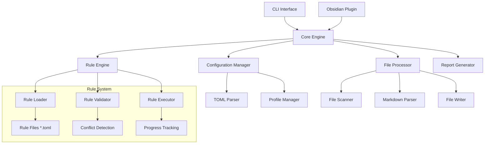

# Design Document

## Overview

The Obsidian Lint Tool is architected as a dual-interface system providing both a standalone CLI utility and an Obsidian plugin. The core engine is built in TypeScript using ECM modules and Bun as the build tool, with a pluggable rule system that supports hierarchical rule IDs and variant management. The system uses TOML configuration files with a profile-based approach for rule organization and supports parallel file processing with comprehensive progress reporting.

## Architecture

### High-Level Architecture



### Module Structure

```
src/
├── cli/                    # CLI interface
│   ├── index.ts           # Main CLI entry point with shebang
│   ├── commands.ts        # Command definitions and parsing
│   └── progress.ts        # Progress bar implementation
├── plugin/                # Obsidian plugin interface
│   ├── main.ts           # Plugin entry point
│   ├── settings.ts       # Plugin settings UI
│   └── editor.ts         # Editor integration
├── core/                  # Core engine
│   ├── engine.ts         # Main orchestration
│   ├── config.ts         # Configuration management
│   ├── rules.ts          # Rule system
│   └── files.ts          # File processing
├── rules/                 # Rule implementations
│   ├── base.ts           # Base rule interface
│   ├── frontmatter.ts    # Frontmatter rules
│   ├── attachments.ts    # Attachment rules
│   └── linking.ts        # Linking rules
├── utils/                 # Utilities
│   ├── markdown.ts       # Markdown parsing
│   ├── glob.ts           # File globbing
│   └── logger.ts         # Logging system
└── types/                 # TypeScript definitions
    ├── config.ts         # Configuration types
    ├── rules.ts          # Rule types
    └── common.ts         # Common types
```

## Components and Interfaces

### Core Engine Interface

```typescript
export interface LintEngine {
  loadConfiguration(configPath?: string): Promise<Configuration>;
  loadRules(profile: string): Promise<Rule[]>;
  processVault(vaultPath: string, options: ProcessOptions): Promise<LintResult>;
  validateRuleConflicts(rules: Rule[]): ValidationResult;
}

export interface ProcessOptions {
  dryRun: boolean;
  fix: boolean;
  verbose: boolean;
  rules?: string[];
  ignore?: string[];
  generateMoc: boolean;
  parallel: boolean;
}

export interface LintResult {
  filesProcessed: number;
  issuesFound: Issue[];
  fixesApplied: Fix[];
  errors: Error[];
  duration: number;
}
```

### Configuration System

```typescript
export interface Configuration {
  general: GeneralConfig;
  activeProfile: string;
  profiles: Record<string, ProfileConfig>;
}

export interface GeneralConfig {
  vaultRoot?: string;
  dryRun: boolean;
  verbose: boolean;
  fix: boolean;
  parallel: boolean;
  maxConcurrency: number;
}

export interface ProfileConfig {
  name: string;
  description: string;
  rulesPath: string;
  enabledRules: string[]; // Auto-discovered from enabled/ directory
}
```

### Rule System Interface

```typescript
export interface Rule {
  id: RuleId;
  name: string;
  description: string;
  category: string;
  config: RuleConfig;
  lint(file: MarkdownFile): Promise<Issue[]>;
  fix?(file: MarkdownFile, issues: Issue[]): Promise<Fix[]>;
}

export interface RuleId {
  major: string; // e.g., "attachment-organization"
  minor: string; // e.g., "centralized"
  full: string; // e.g., "attachment-organization.centralized"
}

export interface RuleConfig {
  pathAllowlist: string[];
  pathDenylist: string[];
  includePatterns: string[];
  excludePatterns: string[];
  settings: Record<string, any>;
}

export interface Issue {
  ruleId: string;
  severity: 'error' | 'warning' | 'info';
  message: string;
  file: string;
  line?: number;
  column?: number;
  fixable: boolean;
}

export interface Fix {
  ruleId: string;
  file: string;
  description: string;
  changes: FileChange[];
}
```

### File Processing Interface

```typescript
export interface FileProcessor {
  scanVault(vaultPath: string, patterns: string[]): Promise<string[]>;
  parseMarkdownFile(filePath: string): Promise<MarkdownFile>;
  writeFile(filePath: string, content: string): Promise<void>;
  moveFile(oldPath: string, newPath: string): Promise<void>;
}

export interface MarkdownFile {
  path: string;
  content: string;
  frontmatter: Record<string, any>;
  headings: Heading[];
  links: Link[];
  attachments: Attachment[];
  ast: MarkdownAST;
}
```

## Data Models

### Configuration Data Model

The configuration system uses a hierarchical approach with TOML files:

**Main Configuration (`obsidian-lint.toml`)**

```toml
[general]
vault_root = "/path/to/vault"
dry_run = false
verbose = true
fix = true
parallel = true
max_concurrency = 4

[profiles]
active = "default"

[profiles.default]
name = "Default Profile"
description = "Standard Obsidian organization rules"
rules_path = "rules/default"

[profiles.work]
name = "Work Profile"
description = "Minimal rules for work vaults"
rules_path = "rules/work"
```

**Rule File Structure (`rules/default/enabled/attachment-organization.centralized.toml`)**

```toml
[rule]
id = "attachment-organization.centralized"
name = "Centralized Attachment Organization"
description = "Move all attachments to Meta/Attachments directory"
category = "attachment"

[config]
path_allowlist = ["**/*.md"]
path_denylist = ["Meta/Templates/**"]
include_patterns = ["**/*"]
exclude_patterns = [".*"]

[settings]
attachment_directory = "Meta/Attachments"
create_subdirectories = true
preserve_structure = false
update_links = true
```

### Rule Conflict Detection Model

```typescript
export interface ConflictDetection {
  validateRules(rules: Rule[]): ConflictResult;
  detectMajorIdConflicts(rules: Rule[]): ConflictGroup[];
  generateConflictReport(conflicts: ConflictGroup[]): string;
}

export interface ConflictResult {
  valid: boolean;
  conflicts: ConflictGroup[];
  warnings: string[];
}

export interface ConflictGroup {
  majorId: string;
  conflictingRules: Rule[];
  resolution: string;
}
```

## Error Handling

### Error Categories

1. **Configuration Errors**
   - Missing configuration files
   - Invalid TOML syntax
   - Invalid rule configurations
   - Profile not found

2. **Rule Conflicts**
   - Multiple rules with same major ID enabled
   - Circular dependencies between rules
   - Invalid rule file format

3. **File Processing Errors**
   - File access permissions
   - Invalid markdown syntax
   - File system errors during moves/writes

4. **Runtime Errors**
   - Out of memory during large vault processing
   - Network errors for external link validation
   - Plugin API errors in Obsidian integration

### Error Handling Strategy

```typescript
export class LintError extends Error {
  constructor(
    message: string,
    public code: string,
    public context?: Record<string, any>
  ) {
    super(message);
    this.name = 'LintError';
  }
}

export enum ErrorCodes {
  CONFIG_NOT_FOUND = 'CONFIG_NOT_FOUND',
  RULE_CONFLICT = 'RULE_CONFLICT',
  FILE_ACCESS_DENIED = 'FILE_ACCESS_DENIED',
  INVALID_MARKDOWN = 'INVALID_MARKDOWN',
  PLUGIN_API_ERROR = 'PLUGIN_API_ERROR',
}
```

## Testing Strategy

### Unit Testing

- **Rule Testing**: Each rule implementation with various markdown inputs
- **Configuration Testing**: TOML parsing and validation
- **Conflict Detection**: Rule ID conflict scenarios
- **File Processing**: Markdown parsing and manipulation

### Integration Testing

- **CLI Interface**: Command-line argument processing and output
- **Configuration Loading**: Profile switching and rule discovery
- **End-to-End Processing**: Complete vault processing workflows
- **Plugin Integration**: Obsidian API integration points

### Performance Testing

- **Large Vault Processing**: 1000+ files with parallel processing
- **Memory Usage**: Memory consumption during processing
- **Rule Performance**: Individual rule execution times
- **Progress Reporting**: Progress bar accuracy and responsiveness

### Test Structure

```
tests/
├── unit/
│   ├── rules/
│   ├── config/
│   └── utils/
├── integration/
│   ├── cli/
│   ├── plugin/
│   └── e2e/
├── performance/
│   └── large-vault/
└── fixtures/
    ├── vaults/
    ├── configs/
    └── rules/
```

## CLI Implementation Details

### Command Structure

```bash
#!/usr/bin/env bun
obsidian-lint [command] [options] [vault-path]

Commands:
  lint      Run linting on vault (default)
  fix       Run linting with auto-fix enabled
  check     Validate configuration and rules
  rules     List available rules and their status
  profiles  Manage configuration profiles

Options:
  --config, -c      Path to config file
  --profile, -p     Configuration profile to use
  --dry-run, -d     Show changes without applying
  --verbose, -v     Verbose output
  --parallel        Enable parallel processing
  --progress        Show progress bar
  --json            Output results in JSON format
```

### Progress Bar Implementation

```typescript
export class ProgressBar {
  private current: number = 0;
  private total: number = 0;
  private startTime: number = Date.now();

  start(total: number): void;
  update(current: number, message?: string): void;
  finish(): void;

  private calculateETA(): string;
  private formatTime(ms: number): string;
  private renderBar(): string;
}
```

## Obsidian Plugin Integration

### Plugin Architecture

```typescript
export class ObsidianLintPlugin extends Plugin {
  private engine: LintEngine;
  private settings: PluginSettings;
  private statusBar: HTMLElement;

  async onload(): Promise<void>;
  async onunload(): Promise<void>;

  private setupCommands(): void;
  private setupStatusBar(): void;
  private setupSettingsTab(): void;
  private setupEditorExtensions(): void;
}
```

### Real-time Linting

```typescript
export class EditorLinter {
  private rules: Rule[];
  private debounceTimer: NodeJS.Timeout;

  async lintEditor(editor: Editor): Promise<void>;
  private debounce(func: Function, delay: number): Function;
  private showInlineErrors(issues: Issue[]): void;
  private clearInlineErrors(): void;
}
```

### Settings Interface

```typescript
export interface PluginSettings {
  configPath: string;
  activeProfile: string;
  realTimeLinting: boolean;
  showInlineErrors: boolean;
  autoFix: boolean;
  enabledRules: string[];
}
```

## Performance Considerations

### Parallel Processing

- Use worker threads for CPU-intensive rule processing
- Implement file processing queue with configurable concurrency
- Cache parsed markdown ASTs to avoid re-parsing
- Use streaming for large file processing

### Memory Management

- Process files in batches to control memory usage
- Implement garbage collection hints for large operations
- Use memory-mapped files for very large markdown files
- Clear caches periodically during long-running operations

### Optimization Strategies

- Lazy loading of rules based on file patterns
- Skip unchanged files using file modification timestamps
- Implement rule execution ordering based on dependencies
- Use incremental processing for plugin real-time linting

## Security Considerations

### File System Access

- Validate all file paths to prevent directory traversal
- Implement proper permission checking before file operations
- Sanitize user input in configuration files
- Use safe file writing with atomic operations

### Configuration Security

- Validate TOML configuration against schema
- Prevent code injection through rule configurations
- Implement safe evaluation of user-provided patterns
- Audit external dependencies for security vulnerabilities

### Plugin Security

- Follow Obsidian plugin security guidelines
- Implement proper error boundaries to prevent crashes
- Validate all user inputs in settings interface
- Use secure communication with Obsidian APIs
