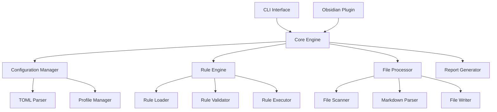

# Obsidian Lint Tool - Developer Guide

## Table of Contents

1. [Architecture Overview](#architecture-overview)
2. [Development Setup](#development-setup)
3. [Creating Custom Rules](#creating-custom-rules)
4. [Rule System Deep Dive](#rule-system-deep-dive)
5. [Testing Guidelines](#testing-guidelines)
6. [Plugin Development](#plugin-development)
7. [Contributing](#contributing)
8. [API Reference](#api-reference)

## Architecture Overview

The Obsidian Lint Tool is built with a modular architecture that separates concerns and allows for extensibility.

### Core Components



### Technology Stack

- **Language**: TypeScript with strict type checking
- **Module System**: ECM (ES Modules)
- **Runtime**: Bun for development and CLI execution
- **Testing**: Vitest for unit and integration tests
- **Configuration**: TOML for human-readable config files
- **Markdown Parsing**: Custom AST parser with frontmatter support

## Development Setup

### Prerequisites

- Node.js 18+ or Bun
- Git
- TypeScript knowledge
- Understanding of Obsidian markdown format

### Installation

```bash
# Clone the repository
git clone https://github.com/your-org/obsidian-lint.git
cd obsidian-lint

# Install dependencies
bun install

# Build the project
bun run build

# Run tests
bun test

# Run in development mode
bun run dev
```

### Project Structure

```
src/
├── cli/                    # CLI interface
│   ├── index.ts           # Main CLI entry point
│   ├── commands.ts        # Command definitions
│   └── progress.ts        # Progress bar implementation
├── plugin/                # Obsidian plugin interface
│   ├── main.ts           # Plugin entry point
│   ├── settings.ts       # Plugin settings UI
│   └── editor.ts         # Editor integration
├── core/                  # Core engine
│   ├── engine.ts         # Main orchestration
│   ├── config.ts         # Configuration management
│   ├── rules.ts          # Rule system
│   └── files.ts          # File processing
├── rules/                 # Rule implementations
│   ├── base.ts           # Base rule interface
│   ├── frontmatter.ts    # Frontmatter rules
│   ├── attachments.ts    # Attachment rules
│   └── linking.ts        # Linking rules
├── utils/                 # Utilities
│   ├── markdown.ts       # Markdown parsing
│   ├── glob.ts           # File globbing
│   └── logger.ts         # Logging system
└── types/                 # TypeScript definitions
    ├── config.ts         # Configuration types
    ├── rules.ts          # Rule types
    └── common.ts         # Common types
```

## Creating Custom Rules

### Rule Basics

Every rule in the system implements the `Rule` interface and follows a specific structure.

### Step 1: Define Rule Interface

```typescript
// src/types/rules.ts
export interface Rule {
  id: RuleId;
  name: string;
  description: string;
  category: string;
  config: RuleConfig;
  lint(file: MarkdownFile): Promise<Issue[]>;
  fix?(file: MarkdownFile, issues: Issue[]): Promise<Fix[]>;
}

export interface RuleId {
  major: string; // e.g., "custom-validation"
  minor: string; // e.g., "strict"
  full: string; // e.g., "custom-validation.strict"
}
```

### Step 2: Create Rule Implementation

```typescript
// src/rules/custom-validation.ts
import { BaseRule } from './base.js';
import { MarkdownFile, Issue, Fix } from '../types/common.js';
import { RuleConfig } from '../types/rules.js';

export class CustomValidationRule extends BaseRule {
  constructor(config: RuleConfig) {
    super({
      id: {
        major: 'custom-validation',
        minor: config.settings.variant || 'default',
        full: `custom-validation.${config.settings.variant || 'default'}`,
      },
      name: 'Custom Validation Rule',
      description: 'Validates custom requirements for notes',
      category: 'validation',
      config,
    });
  }

  async lint(file: MarkdownFile): Promise<Issue[]> {
    const issues: Issue[] = [];

    // Example: Check for required custom field in frontmatter
    if (!file.frontmatter.custom_field) {
      issues.push({
        ruleId: this.id.full,
        severity: 'error',
        message: 'Missing required custom_field in frontmatter',
        file: file.path,
        line: 1,
        fixable: true,
      });
    }

    // Example: Check content requirements
    if (!file.content.includes('## Summary')) {
      issues.push({
        ruleId: this.id.full,
        severity: 'warning',
        message: 'Note should include a Summary section',
        file: file.path,
        fixable: true,
      });
    }

    return issues;
  }

  async fix(file: MarkdownFile, issues: Issue[]): Promise<Fix[]> {
    const fixes: Fix[] = [];

    for (const issue of issues) {
      if (issue.message.includes('custom_field')) {
        // Fix missing frontmatter field
        const newFrontmatter = {
          ...file.frontmatter,
          custom_field: this.config.settings.default_custom_value || 'default',
        };

        fixes.push({
          ruleId: this.id.full,
          file: file.path,
          description: 'Added missing custom_field to frontmatter',
          changes: [
            {
              type: 'frontmatter',
              content: newFrontmatter,
            },
          ],
        });
      }

      if (issue.message.includes('Summary section')) {
        // Fix missing summary section
        fixes.push({
          ruleId: this.id.full,
          file: file.path,
          description: 'Added Summary section',
          changes: [
            {
              type: 'content',
              operation: 'append',
              content: '\n\n## Summary\n\n[Add summary here]\n',
            },
          ],
        });
      }
    }

    return fixes;
  }
}
```

### Step 3: Create Rule Configuration

```toml
# config/rules/default/enabled/custom-validation.strict.toml
[rule]
id = "custom-validation.strict"
name = "Strict Custom Validation"
description = "Enforces strict custom requirements"
category = "validation"

[config]
path_allowlist = ["**/*.md"]
path_denylist = ["Templates/**", "Archive/**"]
include_patterns = ["**/*"]
exclude_patterns = [".*"]

[settings]
variant = "strict"
default_custom_value = "important"
required_sections = ["Summary", "Details"]
enforce_word_count = true
min_word_count = 100
```

### Step 4: Register Rule

```typescript
// src/rules/index.ts
import { CustomValidationRule } from './custom-validation.js';

export const ruleRegistry = {
  'custom-validation': CustomValidationRule,
  // ... other rules
};

// src/core/rules.ts
import { ruleRegistry } from '../rules/index.js';

export class RuleLoader {
  async loadRule(ruleConfig: any): Promise<Rule> {
    const majorId = ruleConfig.rule.id.split('.')[0];
    const RuleClass = ruleRegistry[majorId];

    if (!RuleClass) {
      throw new Error(`Unknown rule: ${majorId}`);
    }

    return new RuleClass(ruleConfig.config);
  }
}
```

### Step 5: Write Tests

```typescript
// tests/unit/rules/custom-validation.test.ts
import { describe, it, expect } from 'vitest';
import { CustomValidationRule } from '../../../src/rules/custom-validation.js';
import { MarkdownFile } from '../../../src/types/common.js';

describe('CustomValidationRule', () => {
  const rule = new CustomValidationRule({
    pathAllowlist: ['**/*.md'],
    pathDenylist: [],
    includePatterns: ['**/*'],
    excludePatterns: [],
    settings: {
      variant: 'strict',
      default_custom_value: 'test',
    },
  });

  it('should detect missing custom_field', async () => {
    const file: MarkdownFile = {
      path: 'test.md',
      content: '# Test\n\nContent',
      frontmatter: { title: 'Test' },
      headings: [],
      links: [],
      attachments: [],
      ast: {} as any,
    };

    const issues = await rule.lint(file);
    expect(issues).toHaveLength(2); // Missing custom_field and Summary section
    expect(issues[0].message).toContain('custom_field');
    expect(issues[1].message).toContain('Summary');
  });

  it('should fix missing custom_field', async () => {
    const file: MarkdownFile = {
      path: 'test.md',
      content: '# Test\n\nContent',
      frontmatter: { title: 'Test' },
      headings: [],
      links: [],
      attachments: [],
      ast: {} as any,
    };

    const issues = await rule.lint(file);
    const fixes = await rule.fix(file, issues);

    expect(fixes).toHaveLength(2);
    expect(fixes[0].description).toContain('custom_field');
    expect(fixes[1].description).toContain('Summary');
  });

  it('should pass validation for compliant files', async () => {
    const file: MarkdownFile = {
      path: 'test.md',
      content: '# Test\n\n## Summary\n\nThis is a summary.',
      frontmatter: {
        title: 'Test',
        custom_field: 'value',
      },
      headings: [],
      links: [],
      attachments: [],
      ast: {} as any,
    };

    const issues = await rule.lint(file);
    expect(issues).toHaveLength(0);
  });
});
```

## Rule System Deep Dive

### Rule Lifecycle

1. **Discovery**: Rules are discovered by scanning the enabled directory
2. **Loading**: Rule configuration files are parsed and validated
3. **Instantiation**: Rule classes are instantiated with configuration
4. **Conflict Detection**: System checks for conflicting major IDs
5. **Execution**: Rules are executed against files
6. **Reporting**: Issues and fixes are collected and reported

### Rule Categories

The system organizes rules into categories for better management:

- `frontmatter`: Frontmatter validation and management
- `content`: Content structure and quality
- `linking`: Internal and external link management
- `attachment`: File attachment organization
- `tagging`: Tag management and consistency
- `organization`: File and folder organization
- `moc`: Map of Content generation
- `custom`: User-defined custom rules

### Rule Variants

Each rule category can have multiple variants:

```typescript
// Example: Frontmatter rule variants
export const frontmatterVariants = {
  strict: {
    required_fields: [
      'title',
      'aliases',
      'tags',
      'status',
      'date_created',
      'date_updated',
    ],
    enforce_format: true,
    validate_dates: true,
  },
  minimal: {
    required_fields: ['title'],
    enforce_format: false,
    validate_dates: false,
  },
  custom: {
    required_fields: [], // User-defined
    enforce_format: true,
    validate_dates: true,
  },
};
```

### Advanced Rule Features

#### Path Filtering

Rules can specify which files they apply to:

```toml
[config]
path_allowlist = ["Daily/**/*.md", "Projects/**/*.md"]
path_denylist = ["Templates/**", "Archive/**"]
include_patterns = ["**/*.md"]
exclude_patterns = [".*", "*.tmp"]
```

#### Conditional Execution

Rules can have conditional logic:

```typescript
async lint(file: MarkdownFile): Promise<Issue[]> {
  // Skip if file is in templates
  if (file.path.includes('Templates/')) {
    return [];
  }

  // Different validation for different file types
  if (file.path.includes('Daily/')) {
    return this.lintDailyNote(file);
  } else if (file.path.includes('Projects/')) {
    return this.lintProjectNote(file);
  }

  return this.lintGenericNote(file);
}
```

#### Rule Dependencies

Rules can depend on other rules:

```typescript
export class DependentRule extends BaseRule {
  dependencies = ['frontmatter-required-fields'];

  async lint(file: MarkdownFile): Promise<Issue[]> {
    // This rule only runs if dependencies are satisfied
    if (!this.areDependenciesSatisfied()) {
      return [];
    }

    // Rule logic here
    return [];
  }
}
```

## Testing Guidelines

### Test Structure

```
tests/
├── unit/                  # Unit tests for individual components
│   ├── rules/            # Rule-specific tests
│   ├── core/             # Core engine tests
│   └── utils/            # Utility function tests
├── integration/          # Integration tests
│   ├── cli/              # CLI integration tests
│   ├── plugin/           # Plugin integration tests
│   └── workflows/        # End-to-end workflow tests
├── performance/          # Performance and load tests
└── fixtures/             # Test data and mock files
    ├── vaults/           # Sample vault structures
    ├── configs/          # Test configurations
    └── rules/            # Test rule files
```

### Writing Rule Tests

#### Unit Tests

```typescript
import { describe, it, expect, beforeEach } from 'vitest';
import { YourRule } from '../../../src/rules/your-rule.js';

describe('YourRule', () => {
  let rule: YourRule;

  beforeEach(() => {
    rule = new YourRule({
      pathAllowlist: ['**/*.md'],
      pathDenylist: [],
      settings: {
        // Test-specific settings
      },
    });
  });

  describe('lint', () => {
    it('should detect issues correctly', async () => {
      const file = createTestFile({
        content: 'problematic content',
        frontmatter: { title: 'Test' },
      });

      const issues = await rule.lint(file);
      expect(issues).toHaveLength(1);
      expect(issues[0].severity).toBe('error');
    });

    it('should handle edge cases', async () => {
      const file = createTestFile({
        content: '',
        frontmatter: {},
      });

      const issues = await rule.lint(file);
      expect(issues).toHaveLength(0); // Should handle empty files gracefully
    });
  });

  describe('fix', () => {
    it('should fix issues correctly', async () => {
      const file = createTestFile({
        content: 'problematic content',
      });

      const issues = await rule.lint(file);
      const fixes = await rule.fix(file, issues);

      expect(fixes).toHaveLength(1);
      expect(fixes[0].changes).toBeDefined();
    });
  });
});
```

#### Integration Tests

```typescript
import { describe, it, expect } from 'vitest';
import { LintEngine } from '../../src/core/engine.js';
import { createTestVault } from '../helpers/vault-helper.js';

describe('Rule Integration', () => {
  it('should work with complete engine', async () => {
    const vaultPath = await createTestVault({
      notes: [{ path: 'test.md', content: '# Test\n\nContent' }],
      config: {
        rules: ['your-rule.variant'],
      },
    });

    const engine = new LintEngine();
    const result = await engine.processVault(vaultPath, {
      dryRun: true,
      fix: false,
    });

    expect(result.issuesFound.length).toBeGreaterThan(0);
  });
});
```

### Performance Testing

```typescript
import { describe, it, expect } from 'vitest';
import { performance } from 'perf_hooks';

describe('Rule Performance', () => {
  it('should process files efficiently', async () => {
    const files = createLargeFileSet(1000);
    const rule = new YourRule(config);

    const start = performance.now();

    for (const file of files) {
      await rule.lint(file);
    }

    const duration = performance.now() - start;
    expect(duration).toBeLessThan(5000); // Should complete within 5 seconds
  });
});
```

## Plugin Development

### Plugin Architecture

The Obsidian plugin integrates with the core engine while providing Obsidian-specific features.

```typescript
// src/plugin/main.ts
import { Plugin, TFile } from 'obsidian';
import { LintEngine } from '../core/engine.js';
import { SettingsTab } from './settings-tab.js';
import { EditorLinter } from './editor-linter.js';

export default class ObsidianLintPlugin extends Plugin {
  private engine: LintEngine;
  private editorLinter: EditorLinter;
  settings: PluginSettings;

  async onload() {
    // Initialize core engine
    this.engine = new LintEngine();

    // Load settings
    await this.loadSettings();

    // Setup editor integration
    this.editorLinter = new EditorLinter(this.engine, this.settings);
    this.registerEditorExtension(this.editorLinter.getExtension());

    // Add commands
    this.addCommands();

    // Add settings tab
    this.addSettingTab(new SettingsTab(this.app, this));

    // Setup status bar
    this.setupStatusBar();
  }

  private addCommands() {
    this.addCommand({
      id: 'lint-current-file',
      name: 'Lint Current File',
      editorCallback: async (editor, view) => {
        const file = view.file;
        if (file) {
          await this.lintFile(file);
        }
      },
    });

    this.addCommand({
      id: 'fix-current-file',
      name: 'Fix Current File',
      editorCallback: async (editor, view) => {
        const file = view.file;
        if (file) {
          await this.fixFile(file);
        }
      },
    });

    this.addCommand({
      id: 'lint-entire-vault',
      name: 'Lint Entire Vault',
      callback: async () => {
        await this.lintVault();
      },
    });
  }

  private async lintFile(file: TFile) {
    const content = await this.app.vault.read(file);
    const markdownFile = await this.parseFile(file, content);

    const result = await this.engine.lintFile(markdownFile);
    this.showResults(result);
  }
}
```

### Editor Integration

```typescript
// src/plugin/editor-linter.ts
import { EditorView, Decoration, DecorationSet } from '@codemirror/view';
import { StateField, StateEffect } from '@codemirror/state';

export class EditorLinter {
  private decorations = StateField.define<DecorationSet>({
    create() {
      return Decoration.none;
    },
    update(decorations, tr) {
      // Update decorations based on linting results
      return decorations.map(tr.changes);
    },
  });

  getExtension() {
    return [
      this.decorations,
      EditorView.decorations.from(this.decorations),
      // Add more extensions as needed
    ];
  }

  async lintEditor(view: EditorView) {
    const content = view.state.doc.toString();
    const issues = await this.engine.lintContent(content);

    const decorations = this.createDecorations(issues);
    view.dispatch({
      effects: StateEffect.define<DecorationSet>().of(decorations),
    });
  }

  private createDecorations(issues: Issue[]): DecorationSet {
    const decorations = issues.map(issue => {
      return Decoration.mark({
        class: `lint-${issue.severity}`,
        attributes: {
          title: issue.message,
        },
      }).range(issue.from, issue.to);
    });

    return Decoration.set(decorations);
  }
}
```

## Contributing

### Development Workflow

1. **Fork and Clone**: Fork the repository and clone your fork
2. **Create Branch**: Create a feature branch for your changes
3. **Develop**: Implement your changes with tests
4. **Test**: Run the full test suite
5. **Document**: Update documentation as needed
6. **Submit PR**: Submit a pull request with clear description

### Code Standards

- **TypeScript**: Use strict TypeScript with proper typing
- **ESLint**: Follow the project's ESLint configuration
- **Prettier**: Use Prettier for code formatting
- **Tests**: Include comprehensive tests for new features
- **Documentation**: Update documentation for user-facing changes

### Commit Guidelines

Use conventional commits:

```
feat: add new rule for custom validation
fix: resolve issue with frontmatter parsing
docs: update developer guide with rule creation
test: add integration tests for CLI commands
refactor: improve rule loading performance
```

## API Reference

### Core Engine API

```typescript
export class LintEngine {
  async loadConfiguration(configPath?: string): Promise<Configuration>;
  async loadRules(profile: string): Promise<Rule[]>;
  async processVault(
    vaultPath: string,
    options: ProcessOptions
  ): Promise<LintResult>;
  async lintFile(file: MarkdownFile): Promise<Issue[]>;
  async fixFile(file: MarkdownFile): Promise<Fix[]>;
}
```

### Rule Interface

```typescript
export interface Rule {
  id: RuleId;
  name: string;
  description: string;
  category: string;
  config: RuleConfig;
  lint(file: MarkdownFile): Promise<Issue[]>;
  fix?(file: MarkdownFile, issues: Issue[]): Promise<Fix[]>;
}
```

### Configuration Types

```typescript
export interface Configuration {
  general: GeneralConfig;
  activeProfile: string;
  profiles: Record<string, ProfileConfig>;
}

export interface RuleConfig {
  pathAllowlist: string[];
  pathDenylist: string[];
  includePatterns: string[];
  excludePatterns: string[];
  settings: Record<string, any>;
}
```

### File Processing Types

```typescript
export interface MarkdownFile {
  path: string;
  content: string;
  frontmatter: Record<string, any>;
  headings: Heading[];
  links: Link[];
  attachments: Attachment[];
  ast: MarkdownAST;
}

export interface Issue {
  ruleId: string;
  severity: 'error' | 'warning' | 'info';
  message: string;
  file: string;
  line?: number;
  column?: number;
  fixable: boolean;
}

export interface Fix {
  ruleId: string;
  file: string;
  description: string;
  changes: FileChange[];
}
```

This developer guide provides comprehensive information for contributing to and extending the Obsidian Lint Tool. It covers everything from basic rule creation to advanced plugin development and testing strategies.
